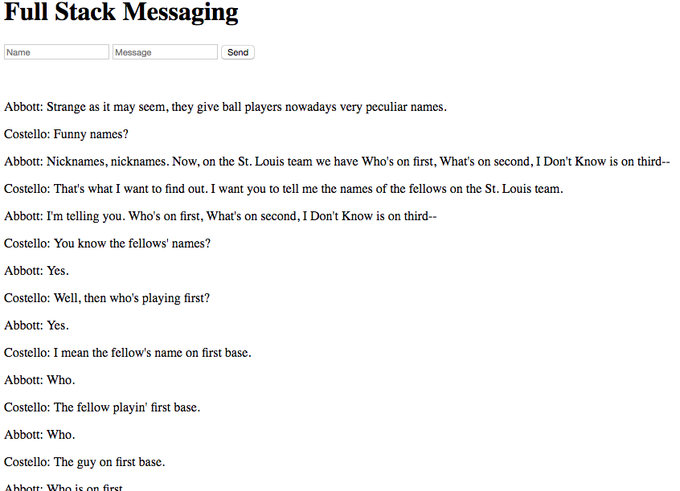

# new-code-challenge-5

Welcome to your last Code Challenge! In this challenge, you are going to build a MEAN stack application. The whole thing. The application you are going to build is a message board. 

Just relax and show us what you know!

## Message Board Application

The message board application you are going to build has the following requirements:

* MUST use Angular and MongoDB
* Your Front End should have two inputs. One for the user's name, the other for the user's message. Additionally, there should be a submit button,
* When the submit button is clicked, you must send the name and message from the inputs to the server to be written to a Mongo Database
* Once the message has been successfully written to the database, display all messages on the DOM,
* If the application page is reloaded, all previous messages should appear.

### NOTE!

* Use of a service is OPTIONAL. Get it working in a Controller first. Add a service if you have time.
* You do not need `ngRoute` (client-side routing)

## Hard Mode

Only after you complete base mode, [click here](supplemental-documentation/hard-mode.md)
